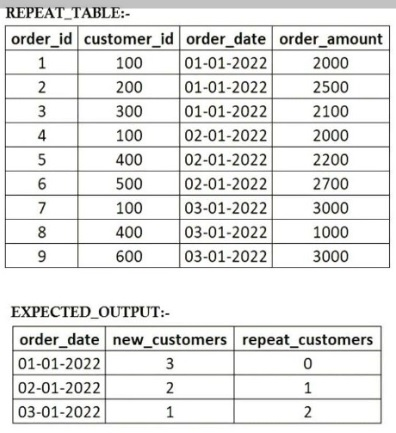

### Problem 1
**Write a query to find the count for New & Repeat Customers for each order date.**  
https://www.linkedin.com/feed/update/urn:li:activity:7112387045758529536/  
The scenario in working with one Table : 'repeat_table'  
The 'repeat_table' includes customer's id, order date and order amount.



```
CREATE TABLE IF NOT EXISTS REPEAT_TABLE(
    order_id INTEGER,
    customer_id INTEGER,
    order_date DATE,
    order_amount FLOAT
);
```

**Insert the data:**
```
INSERT INTO REPEAT_TABLE 
VALUES
(1, 100, '01-01-2022', 2000.0),
(2, 200, '01-01-2022', 2500.0),
(3, 300, '01-01-2022', 2100),
(4, 100, '02-01-2022', 2000),
(5, 400, '02-01-2022', 2200),
(6, 500, '02-01-2022', 2700),
(7, 100, '03-01-2022', 3000),
(8, 400, '03-01-2022', 1000),
(9, 600, '03-01-2022', 3000);
```

```

WITH CTE AS (
  SELECT 
  	customer_id,
  order_date, 
  	ROW_NUMBER() OVER (PARTITION BY customer_id ORDER BY order_date) as row_num
  FROM
  	REPEAT_TABLE
)

SELECT 
	order_date,
    SUM(CASE WHEN row_num=1 THEN 1 ELSE 0 END) AS new_customer,
    SUM(CASE WHEN row_num>1 THEN 1 ELSE 0 END) AS repeat_customer
FROM
	CTE
GROUP BY order_date;
```